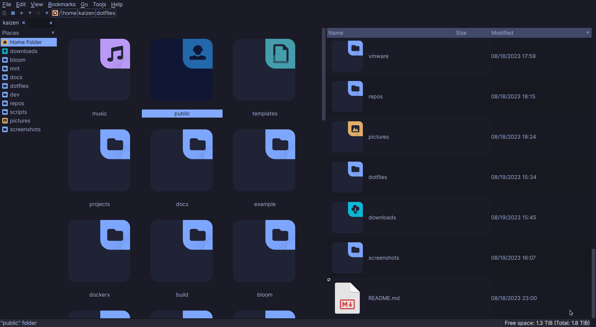
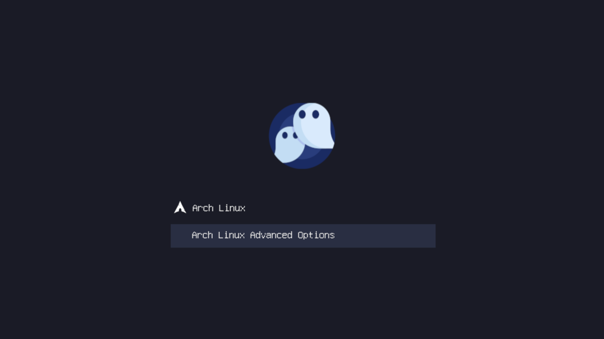

# Wallpapers

This README is auto-generated. You may view its source code [here](docgen.py).
Showcases are randomly chosen. Files are shuffled then first two
from each category are chosen.

## Showcase

Categorized wallpaper showcase. two pictures per category.

## scripts

  

  

[Browse](../scripts/README.md)

## demo

  

  

[Browse](../demo/README.md)

## notes

  

  

[Browse](../notes/README.md)

## themes

  

  

[Browse](../themes/README.md)

## Sources

Following are roughly the sources from where I scraped these images from.

- <https://www.pixiv.net/en/>
- <https://wallpapercave.com/>
- <https://www.freepik.com/>
- <https://in.pinterest.com/>
- <https://pixabay.com/>
- <https://unsplash.com/>
- <https://wallhaven.cc/>
- <https://wallhere.com/>
- <https://deviantart.com/>
- <https://artstation.com/>
- <https://reddit.com/r/kustom/>
- <https://www.reddit.com/r/WallpaperRequests/>
- <https://www.reddit.com/r/wallpaperdump/>
- <https://www.reddit.com/r/wallpaper/>
- <https://www.reddit.com/r/Verticalwallpapers/>
- <https://www.reddit.com/r/unixporn/>
- <https://www.reddit.com/r/Rainmeter/>
- <https://www.reddit.com/r/nordtheme/>
- <https://www.reddit.com/r/manga/>
- <https://www.reddit.com/r/chillhop/>
- <https://www.reddit.com/r/awesomewm/>
- <https://www.reddit.com/r/AnimeWallpaperGif/>
- <https://www.reddit.com/r/Animewallpaper/>
- <https://www.reddit.com/r/animegifs/>
- <https://github.com/wallace-aph/tiles-and-such>

## Ending Note

You may use [download-directory](https://download-directory.github.io) for downloading a specific directory.

I do not own these images. All credits belong to the respective artists.
