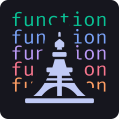
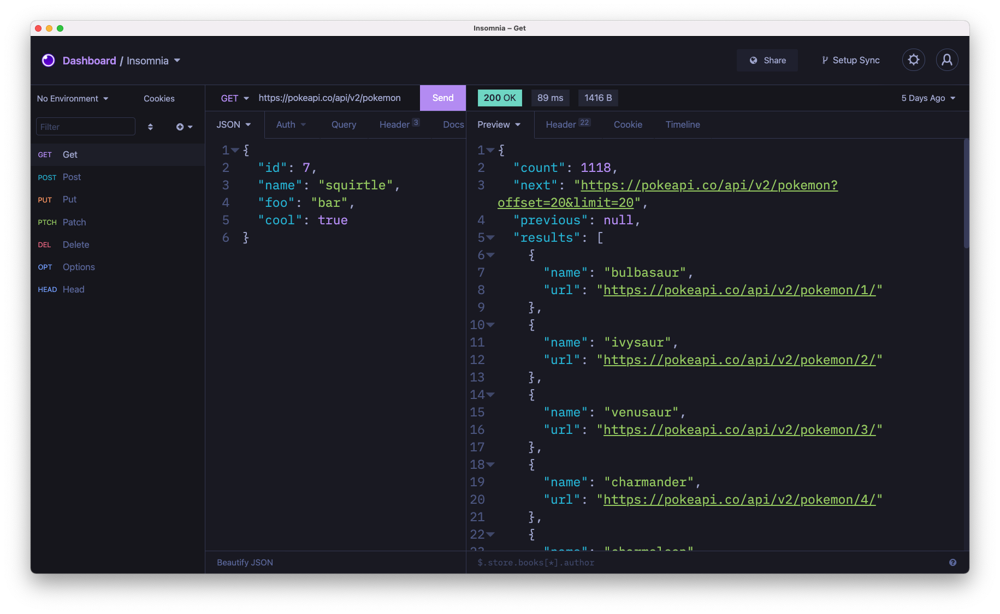
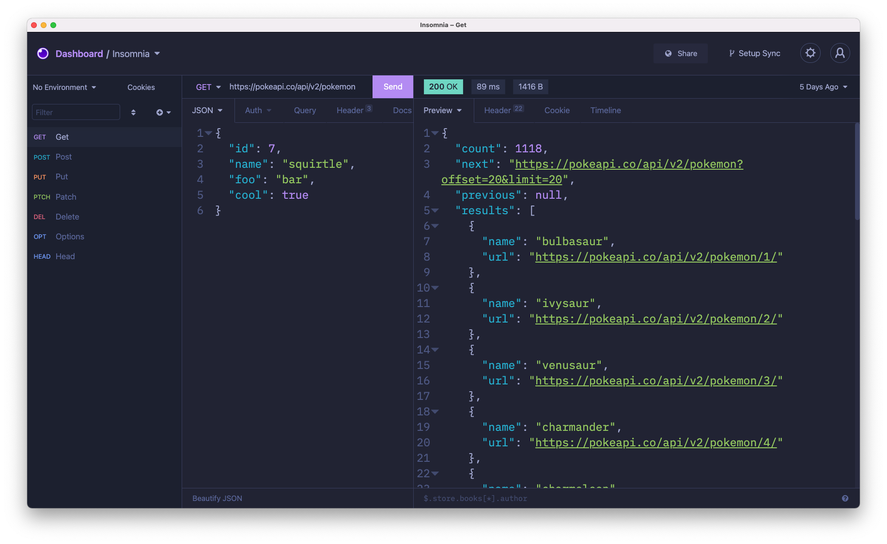
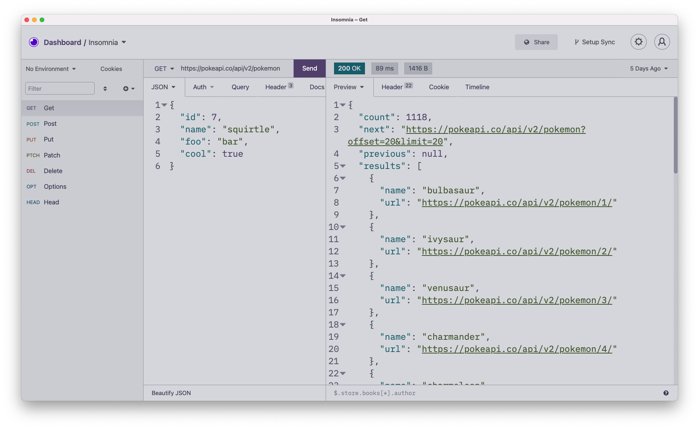

  

<h1 align="center">Tokyo Night for <a href="https://insomnia.rest/">Insomnia</a></h1>

  
  

A clean, dark **Insomnia** theme that celebrates the lights of Downtown Tokyo at night.

Check the wonderful original theme by [@enkia](https://github.com/enkia/) for [Visual Studio Code](https://github.com/enkia/tokyo-night-vscode-theme)

## Screenshots

Default

Storm

Light

## Installation

1. Navigate to **`Preferences > Plugins`**
2. In the **`"Install plugin"`** field, enter **`insomnia-plugin-theme-tokyo-night`**
3. Click **`"Install plugin"`**
4. Navigate to **`Preferences > Themes`** and you should see **Tokyo Night** theme available.

## License

[MIT © Poke](https://github.com/pokedotdev/tokyo-night-insomnia/blob/main/LICENSE)
