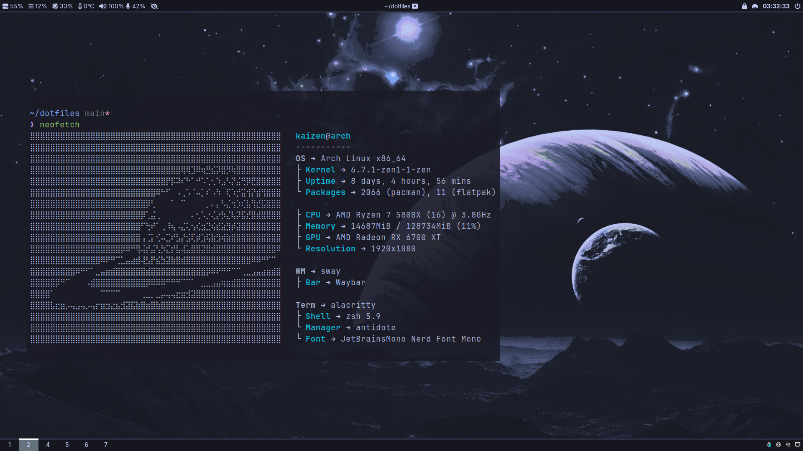
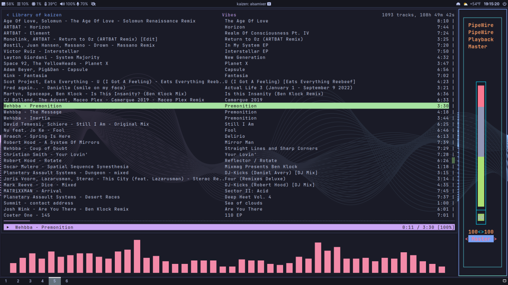
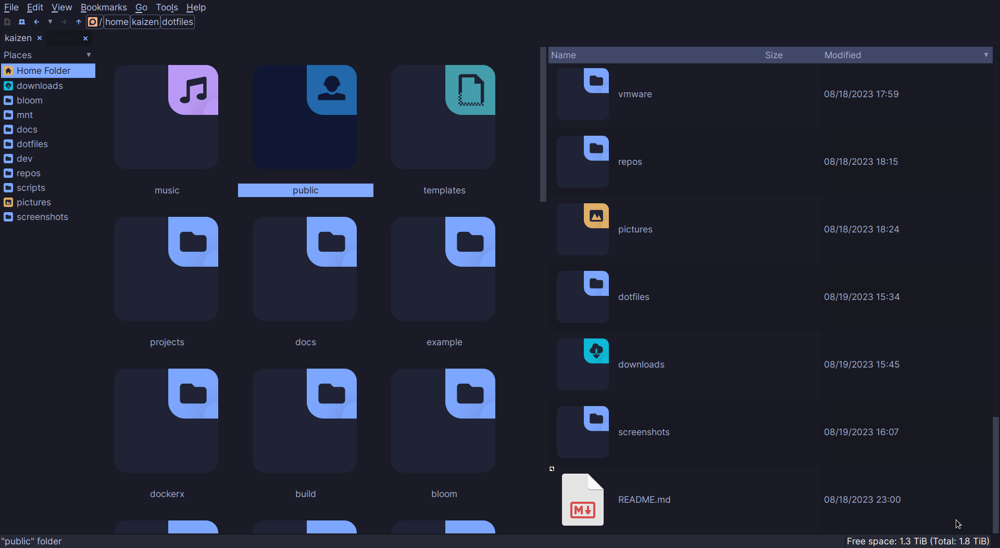
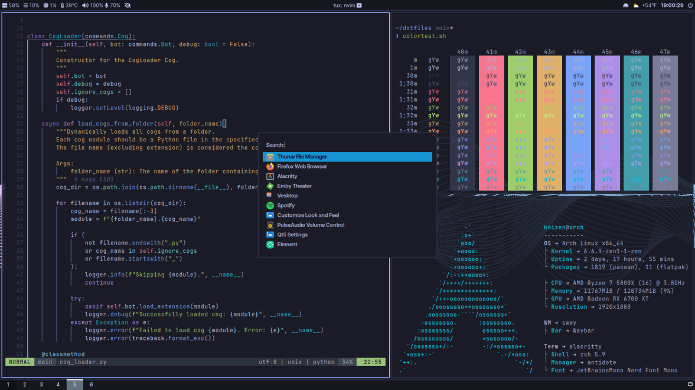

<h1><code>kaizen@arch ᐱ ~/dotfiles</code></h1>

<h3>⚠️ WORK IN PROGRESS ⚠️</h3>

<h2>:question: About</h2>

Welcome to my home, a curated collection of my personal dotfiles, tweaks, themes, and configurations that I use to make my Arch Linux experience truly unique and stylish while also productive.

I use <a href="https://www.gnu.org/software/stow/">GNU Stow</a> to manage my dotfiles. GNU Stow is a symlink farm manager which takes distinct packages of software and/or data located in separate directories on the filesystem, and makes them appear to be installed in the same place.

<h2>:camera: Showcase</h2>
<table>
  <tr>
    <th>neofetch</th>
    <th>ncspot/cava</th>
  </tr>
  <tr>
    <td align="center">
      
    </td>
    <td align="center">
      
    </td>
  </tr>
  <tr>
    <th>pcmanfm</th>
    <th>fuzzel</th>
  </tr>
  <tr>
    <td align="center">
      
    </td>
    <td align="center">
      
    </td>
  </tr>
</table>

<h2>:mag: Overview</h2>
<table>
  <tr>
    <th>Feature</th>
    <th>Package</th>
  </tr>
  <tr>
    <td>Window Manager</td>
    <td><a href="https://github.com/swaywm/sway">sway</a></td>
  </tr>
  <tr>
    <td>Terminal</td>
    <td><a href="https://github.com/ghostty-org/ghostty">ghostty</a></td>
  </tr>
  <tr>
    <td>Shell</td>
    <td><a href="https://www.zsh.org/">zsh</a></td>
  </tr>
  <tr>
    <td>Editor</td>
    <td><a href="https://github.com/microsoft/vscode">vscode</a></td>
  </tr>
  <tr>
    <td>Dock</td>
    <td><a href="https://github.com/Alexays/Waybar">waybar</a></td>
  </tr>
  <tr>
    <td>Notification Manager</td>
    <td><a href="https://github.com/ErikReider/SwayNotificationCenter">swaync</a></td>
  </tr>
  <tr>
    <td>Application Launcher</td>
    <td><a href="https://codeberg.org/dnkl/fuzzel">fuzzel</a></td>
  </tr>
  <tr>
    <td>File Manager</td>
    <td><a href="https://github.com/xfce-mirror/thunar">thunar</a></td>
  </tr>
  <tr>
    <td>Greeter</td>
    <td><a href="https://github.com/rharish101/ReGreet">regreet</a></td>
  </tr>
</table>

<h2>:art: Theme</h2>

<h3><samp>Fonts</samp></h3>
<table>
  <tr>
    <th>Use</th>
    <th>Font List</th>
  </tr>
  <tr>
    <td>Primary Font</td>
    <td><a href="https://aur.archlinux.org/packages/nerd-fonts-inter">Inter Nerd Font</a></td>
  </tr>
  <tr>
    <td>Primary Mono Font</td>
    <td><a href="https://www.programmingfonts.org/#jetbrainsmono">JetBrainsMono Nerd Font</a></td>
  </tr>
</table>

<h3><samp>Icons and Cursors</samp></h3>
<table>
  <tr>
    <td><a href='https://github.com/ljmill/tokyo-night-icons'>Tokyo Night SE</a></td>
    <td><a href='https://gitlab.com/cursors/simp1e'>Simp1e Tokyo Night</a></td>
  </tr>
  <tr>
    <td></td>
    <td></td>
  </tr>
</table>

<h3><samp>Colors</samp></h3>
<table>
  <tr>
    <th>Color</th>
    <th>Hex code</th>
    <th>PNG</th>
    <th>Color</th>
    <th>Hex code</th>
    <th>PNG</th>
  </tr>
  <tr>
    <td>background</td>
    <td>#1b1b25</td>
    <td></td>
    <td>red</td>
    <td>#cb5760</td>
    <td></td>
  </tr>
  <tr>
    <td>background 2</td>
    <td>#282A36</td>
    <td></td>
    <td>green</td>
    <td>#999f63</td>
    <td></td>
  </tr>
  <tr>
    <td>background 3</td>
    <td>#16161e</td>
    <td></td>
    <td>yellow</td>
    <td>#d4a067</td>
    <td></td>
  </tr>
  <tr>
    <td>border</td>
    <td>#343746</td>
    <td></td>
    <td>blue</td>
    <td>#6c90a8</td>
    <td></td>
  </tr>
  <tr>
    <td>foreground</td>
    <td>#A9B1D6</td>
    <td></td>
    <td>purple</td>
    <td>#776690</td>
    <td></td>
  </tr>
  <tr>
    <td>white</td>
    <td>#eeffff</td>
    <td></td>
    <td>cyan</td>
    <td>#528a9b</td>
    <td></td>
  </tr>
  <tr>
    <td>gray</td>
    <td>#727480</td>
    <td></td>
    <td>pink</td>
    <td>#ffa8c5</td>
    <td></td>
  </tr>
  <tr>
    <td>black</td>
    <td>#15121c</td>
    <td></td>
    <td>orange</td>
    <td>#c87c3e</td>
    <td></td>
  </tr>
</table>

<h2>Useful keybinds to know</h2>
<ul>
  <li><code>super + Return</code> Open a terminal.</li>
  <li><code>super + d</code> Open the application launcher (fuzzel).</li>
  <li><code>super + c</code> Open color picker and copy to clipboard.</li>
  <li><code>super + Period</code> Open emoji picker (rofimoji).</li>
  <li><code>super + Shift + n</code> Toggle notifications with swaync.</li>
  <li><code>Print</code> Capture entire screen and copy to clipboard.</li>
  <li><code>Control + Print</code> Capture selected area to clipboard with swappy.</li>
  <li><code>super + Shift + s</code> Capture selected area and copy to clipboard.</li>
  <li><code>super + s</code> Change layout to stacking.</li>
  <li><code>super + w</code> Change layout to tabbed.</li>
  <li><code>super + e</code> Toggle split layout.</li>
  <li><code>super + f</code> Fullscreen the focused container.</li>
  <li><code>super + Shift + f</code> Fullscreen the parent container and then the child.</li>
  <li><code>super + Shift + space</code> Toggle floating mode for the focused container.</li>
  <li><code>super + Shift + q</code> Kill the focused window.</li>
  <li><code>super + Shift + r</code> Reload sway configuration.</li>
  <li><code>super + Shift + e</code> Exit sway with confirmation.</li>
</ul>

<h2>:gear: Installation</h2>
<blockquote>
  
<strong>Warning:</strong> Be careful running commands found on the internet blindly!

</blockquote>
<pre>
<code>
git clone https://github.com/kaizensh/dotfiles.git
</code>
</pre>

<h2>Acknowledgements</h2>

A big shoutout to the open-source community, fellow Arch enthusiasts, and creators of the tools and themes that have inspired and helped shape this repository. I have tried my best to give credit to all original authors that I have used or modified work from but if any were missed, please reach out.

<ul>
  <li><a href="https://github.com/enkia">@enkia</a></li>
  <li><a href="https://github.com/ljmill">@ljmill</a></li>
  <li><a href="https://github.com/Dyzean">@dyzean</a></li>
  <li><a href="https://github.com/Fausto-Korpsvart">@fausto-korpsvart</a></li>
  <li><a href="https://github.com/zatchheems">@zatchheems</a></li>
  <li><a href="https://github.com/stronk-dev">@stronk-dev</a></li>
  <li><a href="https://github.com/alexadhy">@alexadhy</a></li>
  <li><a href="https://github.com/mino29">@mino29</a></li>
  <li><a href="https://github.com/rototrash">@rototrash</a></li>
  <li><a href="https://github.com/adi1090x">@adi1090x</a></li>
  <li><a href="https://github.com/magdalipka">@magdalipka</a></li>
  <li><a href="https://github.com/AtaraxiaSjel">@ataraxiasjel</a></li>
</ul>

<h2>Contributions</h2>

Contributions are welcome – whether it's bug fixes, new features, or additional themes. Please fork this repository, create a new branch, commit your changes, and open a pull request. Let's make Arch Linux even better, together!

